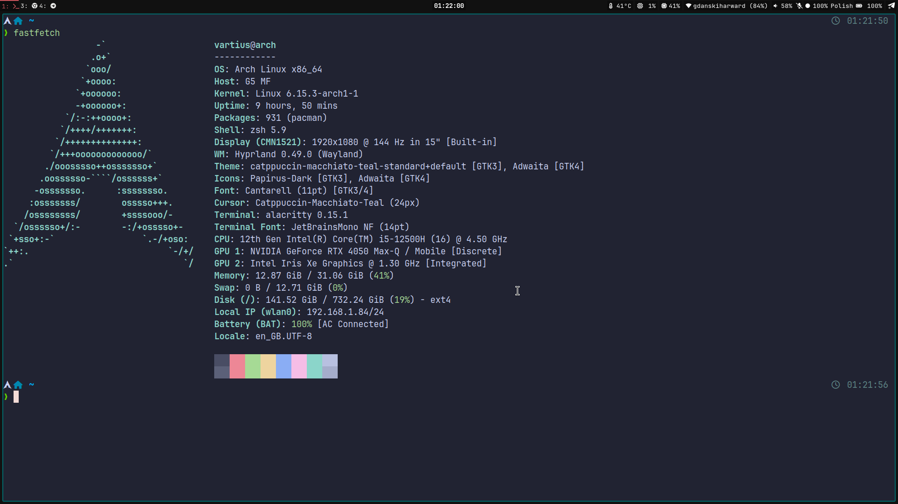

# 🐧 Dotfiles for Hyprland

  

A meticulously crafted collection of personal dotfiles for a sleek and efficient **Hyprland-based Linux environment**. This repository automates the management and deployment of configurations for my favorite tools and applications.

---

### ✨ Preview


---

## 🧭 Table of Contents

- [🐧 Dotfiles for Hyprland](#-dotfiles-for-hyprland)
    - [✨ Preview](#-preview)
  - [🧭 Table of Contents](#-table-of-contents)
  - [🌟 About This Project](#-about-this-project)
  - [📦 Managed Configurations](#-managed-configurations)
  - [🚀 Getting Started](#-getting-started)
    - [Prerequisites](#prerequisites)
    - [Installation](#installation)
  - [🛠️ Usage](#️-usage)
    - [The `update.sh` Script](#the-updatesh-script)
      - [How it Works:](#how-it-works)
      - [How to Use:](#how-to-use)
  - [🎨 Customization](#-customization)
  - [🤝 Contributing](#-contributing)
  - [📜 License](#-license)

---

## 🌟 About This Project

These dotfiles represent my development and desktop environment. They are highly customized for a workflow centered around efficiency and aesthetics, primarily on a Hyprland setup. The core of this repository is the `update.sh` script, which makes keeping everything in sync effortless.

**Key Features:**

*   **💻 Hyprland Focused:** Tailored for the Hyprland Wayland compositor.
*   **🤖 Automated Updates:** Includes a script to sync local changes to the repository automatically.
*   **🎨 Cohesive Theming:** Consistent theming across GTK applications, the terminal, and Waybar.
*   **🚀 Ready to Deploy:** Structured for easy installation on a new system.

---

## 📦 Managed Configurations

These dotfiles manage the configurations for the following applications and tools:

| Category          | Application/Tool                                      |
| ----------------- | ----------------------------------------------------- |
| **Terminal**      | `Alacritty`, `Tmux`, `Zsh` with `Oh My Zsh`               |
| **Desktop**       | `Hypr` (Window Manager), `Waybar` (Status Bar), `Rofi` (Launcher) |
| **Theming**       | `GTK-2.0`, `GTK-3.0`, `GTK-4.0`, `nwg-look`             |
| **Development**   | `Neovim`                                              |
| **System**        | `Neofetch`                                            |

---

## 🚀 Getting Started

Follow these steps to get your own environment set up with these dotfiles.

### Prerequisites

*   A Linux-based operating system
*   Git installed
*   The applications listed in the [Managed Configurations](#-managed-configurations) section installed on your system.

### Installation

1.  **Clone the Repository:**
    ```bash
    git clone <your-repository-url> ~/dotfiles
    ```

2.  **Create Symbolic Links:**
    You need to link the configuration files from the `~/dotfiles` directory to their correct locations in your home and `.config` directories.

    **Example:** To symlink the Hyprland configuration:
    ```bash
    # Create the .config directory if it doesn't exist
    mkdir -p ~/.config

    # Symlink the hypr directory
    ln -s ~/dotfiles/.config/hypr ~/.config/hypr
    ```
    > **Note:** You can write a script to automate the symlinking process for all managed configurations.

---

## 🛠️ Usage

### The `update.sh` Script

The `update.sh` script is the key to maintaining this repository. It automates the process of copying your local dotfiles *into* this repository, committing the changes, and pushing them to the remote.

#### How it Works:

1.  **Syncs `.config` & Home Files:** Copies the configuration directories and files specified in the script's arrays from your local system.
2.  **Syncs Oh My Zsh:** Mirrors your local `~/.oh-my-zsh` directory.
3.  **Performs Git Magic:** Automatically stages and commits all changes with a timestamped message, then prompts you to push them to your remote repository.

#### How to Use:

1.  **Configure the Script:** Open `update.sh` and make sure the `DOTFILES_REPO_DIR` variable points to the location of this repository.
2.  **Customize Arrays:** Edit the `CONFIG_DIRS_TO_COPY` and `HOME_FILES_TO_COPY` arrays to match the dotfiles you want to manage.
3.  **Run it:**
    ```bash
    ./update.sh
    ```

---

## 🎨 Customization

Feel free to fork this repository and make it your own!

You will likely want to modify:

*   The configurations themselves to suit your workflow and preferences.
*   The `update.sh` script to add or remove applications you wish to manage.

---

## 🤝 Contributing

While this is a personal repository, suggestions and improvements are always welcome. If you have an idea, feel free to open an issue to discuss it.

---

## 📜 License

This project is licensed under the MIT License. See the `LICENSE` file for more details.
